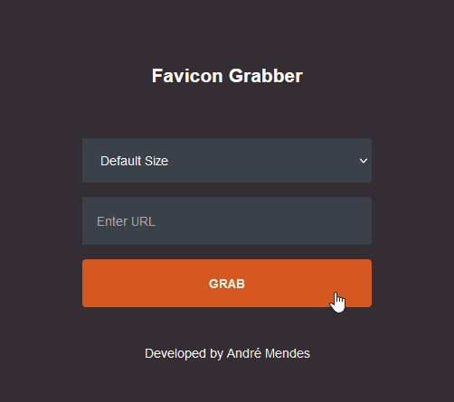

<h1 align="center">Project Favicon Grabber</h1>

<h2>Description</h2>

This, is a simple project created in the course <b>Favicon Grabber Using JavaScript</b> taught by the teacher: Narendra Dwivedi.

We Have Used Google & DuckDuckGo API For Grabbing The Favicon 

---

  

